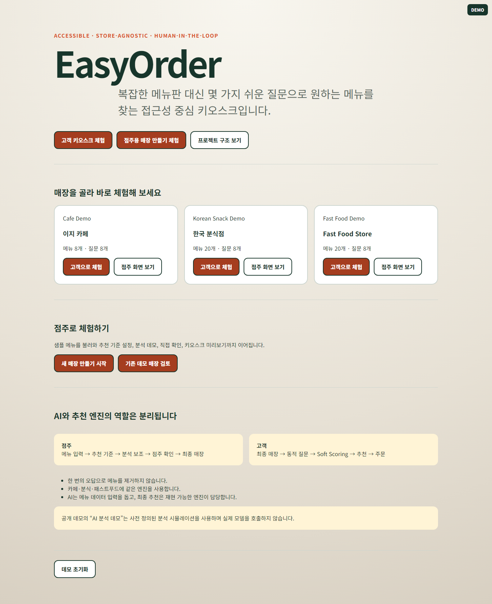
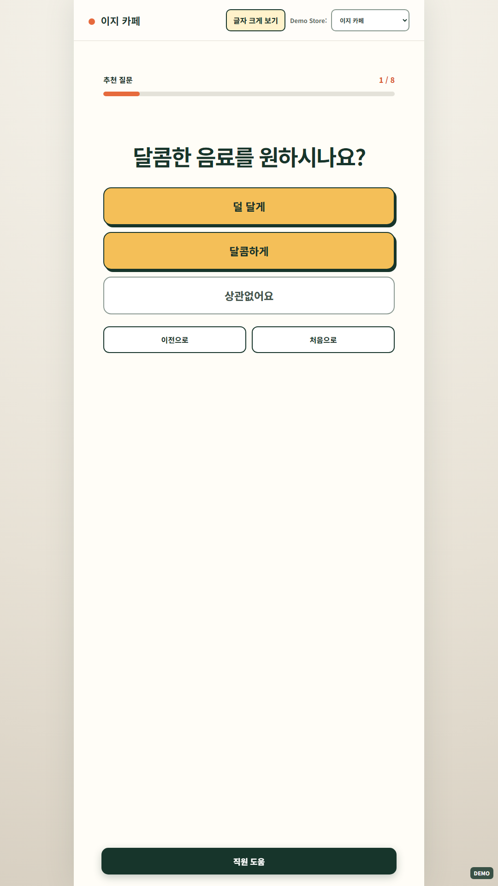
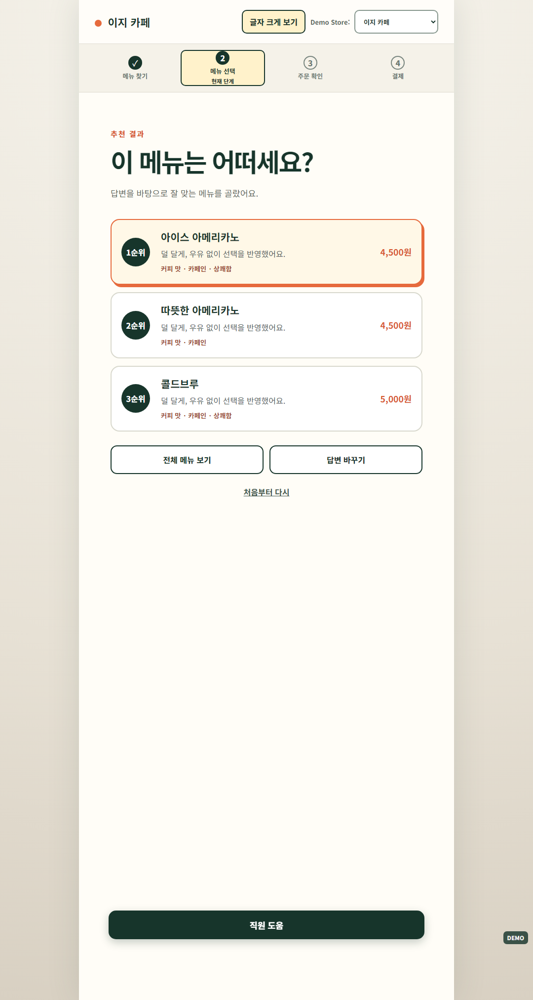
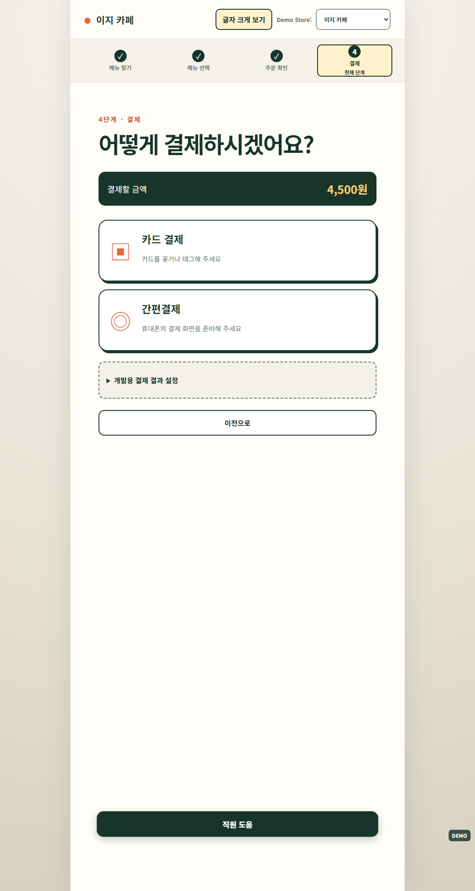
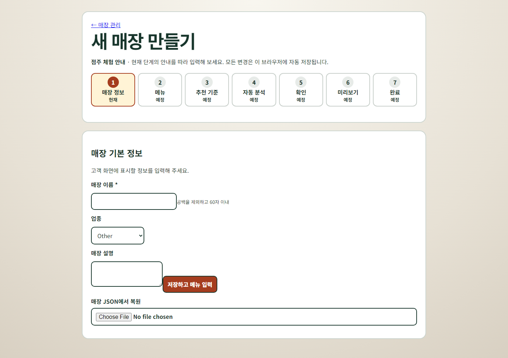
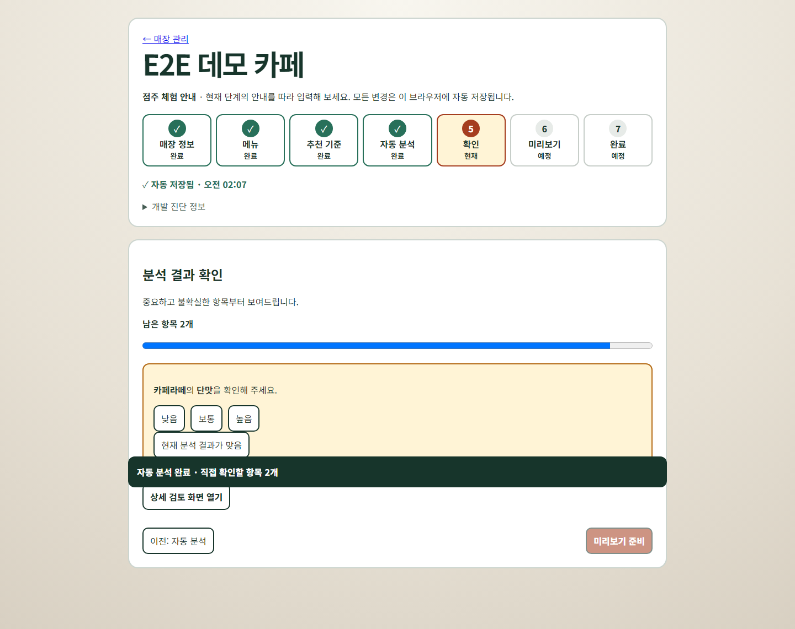

# EasyOrder

복잡한 메뉴판을 직접 탐색하는 대신 몇 가지 쉬운 질문으로 원하는 메뉴를 찾는 접근성 중심 키오스크 MVP입니다. 한 번의 애매한 답이나 오답으로 메뉴를 제거하지 않으며, 카페·분식·패스트푸드가 같은 Store-agnostic 엔진을 사용합니다.

## Quick Start

```bash
npm install
npm run dev
```

- Demo Home: `http://localhost:5173/`
- Customer Kiosk: `http://localhost:5173/kiosk`
- Owner: `http://localhost:5173/owner`
- Owner Wizard: `http://localhost:5173/owner/new`
- Adjudication: `http://localhost:5173/adjudication` — 개발·연구용 데이터 검토 화면
- Optional AI server: `npm run server:enrichment`

공개 데모는 `VITE_DEMO_MODE=true`와 Mock Provider만으로 동작하며 OpenAI API가 필요하지 않습니다.

## 핵심 흐름과 책임 분리

```text
Owner
Menu Import → Schema → AI Enrichment → Owner Review → Final Store

Customer
Final Store → Dynamic Question Generator → Soft Scoring → Recommendation → Checkout
```

AI는 비정형 메뉴를 추천 엔진용 속성 데이터로 정리하는 점주 보조 계층입니다. 고객의 최종 추천은 점주가 확인한 데이터와 deterministic question/scoring engine이 담당합니다. 따라서 AI 장애나 Provider 교체가 주문 판단을 직접 지배하지 않습니다.

## Product

- 접근성 중심 고객 키오스크와 큰 터치 영역
- Information Gain 기반 동적 질문과 오답 허용 Soft Scoring
- Store-agnostic Attribute Schema
- 메뉴 검색, 추천, 옵션, 장바구니, 결제 시뮬레이션
- CSV/JSON 기반 Owner Wizard, 자동 저장, 복구, 미리보기
- AI-assisted enrichment와 Human-in-the-loop Owner Review

## Research / Evaluation

제품 런타임과 분리된 개발·연구 도구입니다.

- Evaluation Harness와 다중 모델/입력 방식 비교
- Automated Stress Test와 Ground Truth Audit
- Provisional Risk Policy Optimization
- Rater A/B/C Human Adjudication UI

연구 결과나 provisional policy는 자동으로 production Owner Review에 적용되지 않습니다.

## 검증 범위와 지표

- Cafe / Korean Snack / Fast Food 3-domain architecture 검증
- Mega 20-menu 및 Snack 20-menu evaluation
- Snack automated stress test의 provisionally stable subset: **50.63%**
- 해당 stable subset 모델 결과: Luna **98.77%**, Terra **100%**

이 수치는 제한된 데이터셋과 automated stress-test 조건의 결과입니다. **Stable subset은 human-verified Ground Truth가 아니며**, 전체 메뉴·속성·실매장 일반화 성능을 의미하지 않습니다. Production 모델과 threshold도 확정값이 아닙니다.

## Screenshots

스크린샷은 고정된 Mock 데이터와 Playwright Chromium으로 생성합니다.

### Demo Home



### Customer Kiosk

고객 흐름: 질문 → 추천 → 옵션 → 결제





### Owner Onboarding

점주 흐름: CSV → 추천 기준 → AI 분석 데모 → 점주 검토 → Kiosk




## Demo 데이터

위저드에서 버튼으로 불러오거나 직접 내려받을 수 있습니다.

- `public/samples/cafe-menu.csv`
- `public/samples/snack-menu.csv`
- `public/samples/fastfood-menu.csv`

데모에서 생성한 매장은 일반 사용자 매장과 별도로 표시되며 Demo Home의 초기화 기능은 데모 생성 데이터만 삭제합니다.

## 환경과 AI 안전장치

```env
VITE_DEMO_MODE=true
VITE_ATTRIBUTE_PROVIDER=mock
ATTRIBUTE_PROVIDER=mock
```

실제 AI를 사용할 때만 브라우저 Provider를 `server`, 서버 Provider를 `openai`로 설정하고 서버 환경에 `OPENAI_API_KEY`와 모델명을 둡니다. 키는 `VITE_` 변수나 브라우저 번들에 넣지 않습니다.

서버 endpoint는 현재 최대 256KB 본문, 50개 메뉴, 30개 속성, IP당 분당 20회 요청을 허용합니다. 이는 공개 MVP용 최소 방어이며 계정 quota, 분산 rate limiting, abuse monitoring을 대체하지 않습니다.

## Deployment

### Portfolio Demo Deployment

Vite 정적 산출물만 배포합니다. Mock Provider가 브라우저에서 동작하므로 enrichment server, `OPENAI_API_KEY`, 기타 secret이 필요 없습니다.

Vercel Project Settings:

- Framework Preset: `Vite`
- Install Command: `npm install`
- Build Command: `npm run build`
- Output Directory: `dist`
- Environment: `VITE_DEMO_MODE=true`
- Environment: `VITE_ATTRIBUTE_PROVIDER=mock`

```bash
npm run build
# publish: dist/
```

루트의 `vercel.json`은 `/kiosk`, `/owner`, `/owner/new`, `/adjudication`을 포함한 SPA direct route를 `/index.html`로 rewrite하고 기본 `nosniff` 및 referrer header를 적용합니다. 이는 [Vercel의 Vite SPA deep-linking 구성](https://vercel.com/docs/frameworks/frontend/vite)을 따릅니다.

배포 후 원격 smoke test:

```powershell
$env:PLAYWRIGHT_BASE_URL="https://your-project.vercel.app"
npm run test:e2e:remote
```

```bash
PLAYWRIGHT_BASE_URL=https://your-project.vercel.app npm run test:e2e:remote
```

원격 suite는 로컬 Vite server를 시작하지 않으며 Demo Home, public sample CSV, Cafe/Snack/Fast Food, Owner/Wizard, direct route와 refresh를 확인합니다. Mock 배포에서 `/api/attribute-enrichment` 요청이 발생하면 실패합니다.

### Production AI deployment

정적 frontend와 `server/index.ts` 기반 enrichment API를 별도 서비스로 배포합니다. API key는 서버에만 저장하고 frontend의 `/api/attribute-enrichment`를 해당 endpoint로 연결합니다.

### Vercel compatibility

Mock-only Portfolio Demo는 현재 구조 그대로 배포 가능합니다. `server/`는 배포에 포함되는 API가 아니라 production AI용 개발 코드로 유지합니다. 실제 AI는 별도 배포와 운영 보호가 필요한 의도적으로 분리된 범위입니다.

## Quality Gates

```bash
npm test
npm run typecheck
npm run build
npm run audit:bundle
npm run test:e2e
npm run screenshots
```

Playwright를 처음 설치한 환경에서는 Chromium만 준비하면 됩니다.

```bash
npx playwright install chromium
```

`npm run test:e2e:ui`로 로컬 interactive runner를 열 수 있습니다. E2E는 `VITE_DEMO_MODE=true`와 Mock Provider를 강제하며 `/api/attribute-enrichment` 요청이 발생하면 실패합니다.

AI evaluation 명령은 공개 데모 실행과 분리되어 있으며 명시적으로 환경을 구성했을 때만 사용합니다.

## Known Limitations

- LocalStorage only; 계정과 cloud sync 없음
- 실제 POS, PG, 결제, 재고 연동 없음
- 공개 Demo AI는 Mock Provider 사용 가능
- Ground Truth와 사용자 연구의 human validation이 제한적임
- 실제 세로형 키오스크 하드웨어·스크린리더·장시간 운영 QA 미완료
- 서버 rate limit은 단일 프로세스 메모리 기반의 최소 보호
- Owner/Adjudication 화면은 포트폴리오 MVP이며 운영 권한 모델이 없음

## Status

Portfolio-ready functional MVP. 다음 검증 우선순위는 실제 사용자 관찰 테스트, 키오스크 하드웨어 QA, 배포 환경의 접근성 점검입니다. 로그인·DB·POS·PG는 이 검증 이후 운영 제품 단계에서 도입합니다.
